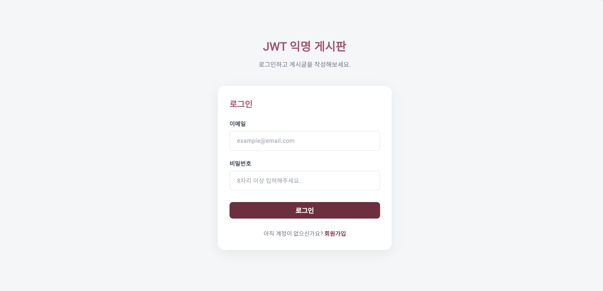
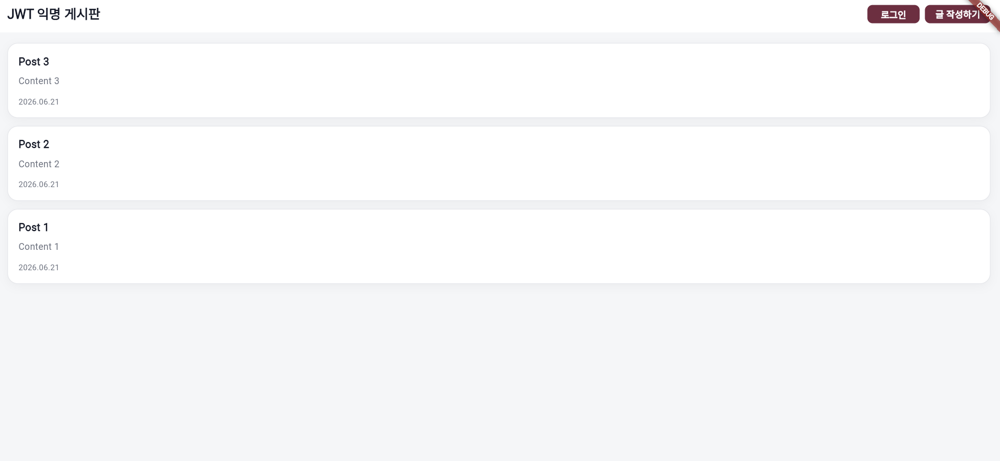
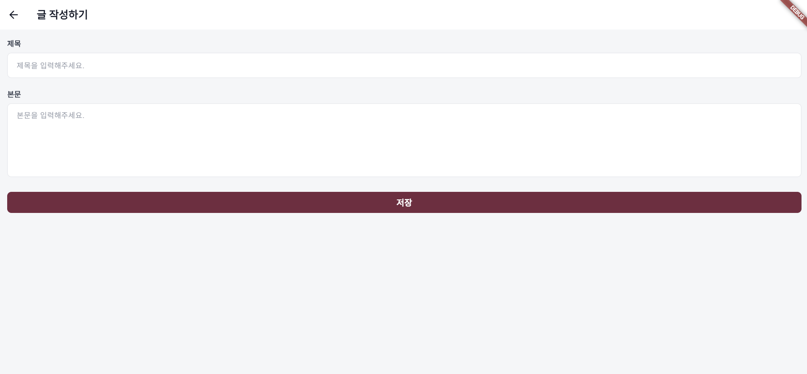

# JWT Anonymous Board

> **제출자:** 김은수  
> **이메일:** eunsukim22@gmail.com  
> **GitHub:** https://github.com/shushuburger

보이노시스 JWT 기반 익명 게시판 채용 과제입니다. NestJS 백엔드 + Flutter 프론트엔드 모노레포이며, 회원가입·로그인·게시글 목록·작성을 구현했습니다.

---

## 1. 로컬 실행 방법

### 사전 요구사항

- Node.js 18+, npm
- Flutter SDK 3.24+ (Dart 3.5+)
- Web 실행 시 백엔드 CORS 필요 (`backend/src/main.ts` — `app.enableCors()`)

### Backend

```bash
cd backend

npm install
cp .env.example .env          # 아래 Env 항목을 로컬 값으로 수정
npx prisma migrate dev        # DB migration 적용 (최초 1회)
npm run start:dev             # http://localhost:3000
```

**Env 설정** (`backend/.env.example` 기준)

| 변수 | 예시 | 설명 |
|------|------|------|
| `DATABASE_URL` | `file:./dev.db` | SQLite DB 파일 경로 |
| `JWT_SECRET` | (32자 이상 랜덤 문자열) | JWT 서명·검증 키 |
| `JWT_EXPIRES_IN` | `1d` | JWT 만료 시간 |

> `.env`는 git에 포함하지 않습니다. `.env.example`만 저장소에 포함됩니다.

### Frontend

```bash
cd frontend

flutter pub get
flutter run -d chrome    # 또는 edge / windows
```

**API Base URL** — `frontend/lib/shared/constants/api_constants.dart`

```dart
static const baseUrl = 'http://localhost:3000';
```

### 실행 순서

1. Backend `npm run start:dev`
2. Frontend `flutter run -d chrome`
3. 회원가입 → 로그인 → 목록 조회 → 글 작성

---

## 2. 상태 관리 라이브러리 및 선정 이유

**사용 라이브러리:** `flutter_riverpod` (Riverpod)

| 선정 이유 | 적용 |
|-----------|------|
| 전역 인증 상태 관리 | `authProvider` — 로그인 여부, 필드 에러 |
| 게시글 목록 상태 관리 | `postsProvider` — 목록, pagination, refresh |
| 비동기 로딩/에러/성공 표현 | `AuthStatus`, `PostsState`, `CreatePostState` |
| Notifier 기반 비즈니스 흐름 분리 | `AuthNotifier`, `PostsNotifier`, `CreatePostNotifier` |
| UI와 상태 로직 분리 | Screen/Form은 UI, Notifier는 API·상태만 담당 |

JWT는 Riverpod State가 아닌 `flutter_secure_storage`에 저장하고, `AuthState`는 `authenticated` 여부만 표현합니다.

---

## 3. 구현하며 가장 고민했던 부분

### 3-1. JWT 자동 로그인과 401 Session Expired

#### 문제

JWT 인증을 도입하면서 아래 요구가 동시에 겹쳤습니다.

- 앱 재시작 후에도 **자동 로그인**이 되어야 함
- `POST /posts` 등 보호 API에는 **Bearer 토큰을 자동으로** 붙여야 함
- 토큰 만료·위조 시 **logout + 로그인 화면 이동**이 필요함
- 반면 `POST /auth/login` 실패(틀린 비밀번호)도 HTTP 401이지만, 여기서 logout하면 안 됨

#### 고민한 이유

- JWT를 Riverpod `AuthState`에 넣으면 접근은 편하지만, 앱 재시작 시 복원·보안 측면에서 Storage와 **이중 관리**가 됨
- Interceptor에서 모든 401에 `logout()`을 호출하면, **틀린 비밀번호 로그인**까지 logout → redirect가 발생
- 401 시 SnackBar·navigate·토큰 삭제를 한 레이어에 몰면 **책임이 겹치고** 테스트가 어려움
- GoRouter를 `authProvider` 변경마다 **재생성**하면 `initialLocation: /`부터 다시 시작하는 문제가 있음

#### 해결 방법

**① JWT 저장 — Secure Storage 단일화**

- JWT → `flutter_secure_storage` (`SecureStorageService`)
- `AuthState` → `authenticated` / `unauthenticated` **여부만** 표현
- 앱 시작 시 `AuthNotifier.restoreSession()`이 storage에서 토큰 존재 여부만 확인

**② Dio Interceptor — 헤더 자동 첨부 + 401 분기**

```text
onRequest  → SecureStorage에서 token 읽기 → Authorization: Bearer {token}
onError    → 401이면서 /auth/login, /auth/signup이 아닐 때만 logout()
```

**③ 401 UX — 레이어별 책임 분리**

| 레이어 | 역할 |
|--------|------|
| `JwtAuthInterceptor` | 보호 API 401 시 `logout()` 트리거 |
| `AuthNotifier.logout()` | SecureStorage 토큰 삭제 + unauthenticated |
| `DioExceptionMapper` | 401 → `ErrorMessages.sessionExpired` |
| `CreatePostActions` | session expired SnackBar |
| `GoRouter` + `router.refresh()` | `/login` redirect (Actions에서 직접 `go`하지 않음) |

**④ GoRouter — 재생성 대신 refresh**

- GoRouter는 **한 번만 생성**
- `ref.listen(authProvider)` → `router.refresh()`로 redirect만 재실행

#### 결과

- 앱 재시작 후 JWT가 있으면 **자동 로그인**
- 틀린 비밀번호 → **비밀번호 필드 인라인 에러**만, logout 없음
- 토큰 만료 후 글 작성 → **session expired SnackBar** + logout + `/login` redirect

---

### 3-2. Infinite Scroll 중복 요청 방지

#### 문제

게시글 목록에 초기 로딩·infinite scroll·pull-to-refresh가 공존하면서 아래 이슈가 발생했습니다.

- `ScrollController` listener가 하단 threshold 안에서 **연속으로** `fetchNextPage()` 호출
- API 응답 전에 다음 페이지 요청이 나가면 **같은 page 중복 요청** 또는 순서 꼬임
- 작성 성공 후 `refreshPosts()` + `fetchInitialPosts()`를 동시에 호출하면 **GET /posts 이중 호출**

#### 고민한 이유

- UI(Screen)에서 `if (loading) return`을 두면 Notifier와 **flag 이중 관리**
- 에러를 `errorMessage` 하나로만 처리하면 refresh 실패 시 **전체 Error View**로 바뀌어 기존 목록이 사라짐
- pagination 실패와 초기 로딩 실패의 **UX가 달라야** 하는데 상태가 분리되지 않으면 표현 불가

#### 해결 방법

**① PostsNotifier — guard clause**

```text
fetchInitialPosts  → isLoading이면 return
fetchNextPage      → isPaginationLoading / hasReachedEnd / isLoading / currentPage==0 이면 return
refreshPosts       → isRefreshing / isLoading이면 return
```

**② 상태·에러 분리**

| 상태/에러 | 용도 | UX |
|-----------|------|-----|
| `isLoading` / `errorMessage` | 최초 로딩 | Error View + retry |
| `isPaginationLoading` / `paginationErrorMessage` | 다음 페이지 | 하단 retry, **목록 유지** |
| `isRefreshing` / `refreshErrorMessage` | pull-to-refresh | SnackBar, **목록 유지** |

**③ 작성 성공 후 목록 갱신 — 단일 진입점**

- `CreatePostActions` → `context.go('/')`만 수행
- 목록 갱신은 `PostsListScreen.initState`의 `fetchInitialPosts()`에 위임

**④ 작성 중복 제출 방지** — `CreatePostNotifier` / `CreatePostActions`의 `isSubmitting` guard + `PopScope`

#### 결과

- 스크롤 하단에서 **페이지당 API 1회**
- refresh·pagination·초기 로딩이 **서로 간섭하지 않음**
- pagination·refresh 실패 시에도 **이미 본 목록 유지**

---

### 3-3. UI / State / Repository 책임 분리

#### 문제

인증·게시글 화면을 구현하다 보면 한 Screen에 API 호출, validation, navigate, SnackBar가 **한꺼번에** 몰리기 쉬웠습니다. login/signup은 구조가 거의 같아 **보일러플레이트**와 **분리 원칙** 사이 trade-off도 있었습니다.

#### 고민한 이유

- Screen에 Dio를 직접 쓰면 `statusCode` 분기가 화면마다 퍼져 **에러 처리 불일치**
- Notifier에 `BuildContext`를 넣으면 **단위 테스트 불가**
- Auth API 실패를 SnackBar로 보여주면 GoRouter·필드 validation UX와 **맞지 않음**

#### 해결 방법

**① Presentation 4분할**

```text
Screen   — controller, ref.watch/listen, ScrollController, PopScope
Actions  — provider 호출, navigate, SnackBar
Form     — UI만 (StatelessWidget + validators)
Widgets  — Loading / Empty / Error / PostCard
```

**② 데이터 계층**

```text
Notifier (AuthNotifier, PostsNotifier)  → BuildContext 없이 상태·API 흐름
Repository (AuthRepository, PostsRepository)  → HTTP, JSON 파싱
DioExceptionMapper  → DioException → AuthFieldErrors / ApiRequestException
```

**③ 화면별 에러 표시 정책**

| 영역 | API/네트워크 실패 |
|------|-------------------|
| Login / Signup | 필드 인라인 (`AuthFieldErrors`) — SnackBar 없음 |
| Posts 목록 (초기) | Error View + retry |
| Posts pagination | 하단 retry |
| Posts refresh | SnackBar |
| Create Post | SnackBar |

**④ 보일러플레이트 완화** — `AuthEmailPasswordFields`, `AuthFormActions`, `AppPrimaryButton`, `LabeledTextField` 등 공통 추출. login/signup **파일 분리는 유지**

#### 결과

- Screen 수정 시 **UI 레이아웃만** 변경하면 됨
- API 변경 시 **Repository만** 수정하면 됨
- Auth / Posts **에러 UX 일관성** 확보

---

## 부록

### 구현 기능 요약

- 회원가입 / 로그인 / JWT Secure Storage / 자동 로그인
- 게시글 목록 (공개, infinite scroll, pull-to-refresh)
- 게시글 작성 (JWT 필수, 익명 UX — 작성자 미표시)
- GoRouter 인증 redirect, 401 session expired 처리

### 스크린샷





### API 요약

| Method | Path | 인증 | 설명 |
|--------|------|------|------|
| POST | `/auth/signup` | 불필요 | 회원가입 |
| POST | `/auth/login` | 불필요 | 로그인 + JWT 발급 |
| GET | `/posts?page=1&limit=10` | 불필요 | 게시글 목록 |
| POST | `/posts` | JWT 필수 | 게시글 작성 |

상세 Request/Response·실패 케이스 → [`backend/README.md`](./backend/README.md)

### 프로젝트 구조

```text
voinosis-jwt-board/
├─ backend/     # NestJS, Prisma, SQLite
├─ frontend/    # Flutter, Riverpod
├─ docs/screenshots/
└─ README.md
```

### 상세 문서

| 문서 | 내용 |
|------|------|
| [`backend/README.md`](./backend/README.md) | API 상세 명세, Validation/E2E, 백엔드 구현 고민 |
| [`frontend/README.md`](./frontend/README.md) | API 경로·프로젝트 구조, 아키텍처 흐름, Flutter 구현 고민 |
